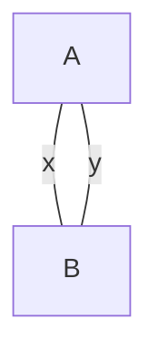

# Ideias básicas sobre grafos

## Multigrafos

Abaixo encontra-se um exemplo de multigrafo não dirigido.

Detalhe: grafos não dirigidos também podem ser multigrafos.

Uma possível representação matricial seria:

| - | a | b |
| - | - | - |
| a | 0 | 2 |
| b | 2 | 0 |

Ou ainda:

| - | a | b |
| - | - | - |
| a | 0 | {x, y} |
| b | {x, y} | 0 |

Na representação formal teríamos:

$G = (V,E)$

$V = \lbrace a,b \rbrace$

$E=\lbrace \lbrace a, b \rbrace ,\lbrace b, a \rbrace \rbrace$

Note que como em $E$, $\lbrace a, b\rbrace$ é parte do conjunto, $E$ se
reduzirá a $E=\lbrace \lbrace a, b \rbrace \rbrace$. Portanto, temos aqui
um problema na representação desta forma específica. Para solução deste
problema, podemos fazer uma diferente representação utilizando tuplas.

$E = \lbrace (\lbrace a, b \rbrace, x), (\lbrace a, b\rbrace, y) = <\lbrace
a, b \rbrace, \lbrace a, b \rbrace>$

Alguns detalhes importante são:

* Verificar a aplicação: Pode interferir na representação matricial
  correta.

* No caso de um multigrafo, fazer uma análise do problema antes. Senão pode
  não ser possível operar com o grafo e a matriz de adjacência.

* Ex: Ciclo Euleriano.

## Complexidade

No quesito do estudo das complexidades temos algumas perspectivas importantes, sendo elas:

* $\Omega{(n)} \rightarrow$ Melhor caso, limitante inferior.
* $\Omicron{(n)} \rightarrow$ Pior caso, limitante superior.

O comportamento médio está entre ou é igual ao melhor e ao pior caso.

Quando $\Omega$ e $\Omicron$ são iguais, teremos um comportamento
asintótico padrão, portanto o descreveremos como:

* $\Theta{(n)}$

## Escalas 

Temos duas escalas de complexidade:

* Polinomiais.
* Exponenciais.

## Estudar teorema mestre e da árvore para cálculo de complexidade
