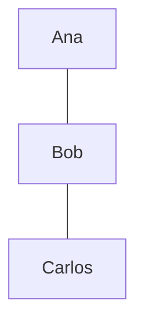
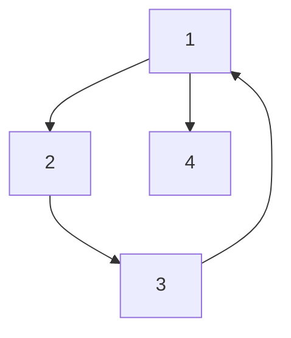

# Representação de Grafos
Representam essencialmente uma realidade, uma modelagem de um problema.

Podem ser definidos, ou representados, primordialmente por
Vértices(nodos)[entidades] e Arestas(não direcionadas) e arcos (direcionados) [ligação de entidades]

Quando uma aresta conecta mais de dois vértices, a chamamos de hiperaresta.

As relações (arestas) podem ter pesos, estes representando de maneira abstraída
a força da relação.

A relação neste exemplo será amizade de entre os indivíduos em uma rede social.
Entende-se então, que neste context não há cabimento a ideia de ser amigo de si
mesmo.

A representação formal pode ser vista como:

$G = (V, E)$ no qual,

$V = \{ Ana, Bob, Carlos \}$ é o conjunto de vértices.

$E = \{ \{Ana, Bob\}, \{Bob, Carlos\} \}$ é o conjunto de arestas.

Nota: As arestas são compostas aqui de conjuntos e não de n-úplas pois aqui não
temos direção. Portanto, entende-se que a ordem não importa.

### Nomenclatura
Nomenclatura: $Ordenado = Dirigido$.

## Representação Gráfica

## Matriz de adjacências

| Vértices | Ana | Bob | Carlos |
| - | - | - | - |
| Ana | 0 | 1 | 0 |
| Bob | 1 | 0 | 1 |
| Carlos | 0 | 1 | 0 |

Aqui 0 indica a falta de relação e 1 a existência dela. Perceba que já que
nesta modelagem não faz sentido o grafo ter qualquer relação na diagonal
principal e a matriz é simétrica. Sendo assim, ela pode ser representada,
ocupando somente 
$( n^2 - n ) / 2$
células.
Sendo: 

$N^2$ : Tamanho total da matriz quadrada (trivialmente observável).

$N$ : Diagonal principal não importa para esta modelagem.

$/2$ : Aqui o grafo não tem direção (grafo não direcionado), sendo assim a
matriz simétrica, incorrendo em que somente metade dos valores sejam de fato
necessários para que a matriz possa ser definida corretamente dada esta
relação.

## Peso

Grafos com peso podem ser representados por:

$G' = (V, E, w)$

Sendo $w$ uma função $E \to Z$, na qual:

$w( \{ Ana, Bob \} ) = 10$,

$w( \{ Bob, Carlos \} ) = 1$

| Vértices | Ana | Bob | Carlos |
| - | - | - | - |
| Ana | inf | 10 | inf |
| Bob | 10 | inf | 1 |
| Carlos | inf | 1 | inf |

Em problemas de custo mínimo, faz mais sentido trocar-se 0 por infinito ou
nulo. Claramente, que não há sentido em questões de custo que a representação de
nulidade inerente à relação seja dada por 0.

$G'''$ = Grafo orientado

$G'''$ = (V', A), no qual

$V = \{ 1, 2, 3, 4 \}$

$A = \{ (1, 4), (1, 2), (2, 3), (3, 1) \}$

Matriz:

| Vértices | 1 | 2 | 3 | 4 |
| - | - | - | - | - |
| 1 | 0 | 1 | 0 | 1 |
| 2 | 0 | 0 | 1 | 0 |
| 3 | 1 | 0 | 0 | 0 |
| 4 | 0 | 0 | 0 | 0 |

Esta representação sendo a relação com o grafo definida por:

$Matriz_{origem|desino} = A_{i|j}$

### Representação Gráfica

## Cardinalidade
$n = | V' | \to cardinalidade$ é um conjunto de vértices

$m = | A  |$

## Propriedades
* Grau
* Vizinhança
* Caminho
* Multigrafo

## Grau
É definido por  $d(n)$
n sendo o vértice.

Exemplo:
$d(1) = 1$
* $d(Ana) = 1$

$d(2) = 2$
* $d(Bob) = 2$

Para grafos orientados, teremos que:

$d^+(n) = Saintes$

$d^-(n) = Entrantes$

## Vizinhança
Vértices que detêm alguma conexão a um outro vértica.

### Definição
É um subgrafo induzido de G constituído por todos os vértices adjacentes a v e
todas as arestas ligando esses dois vértices

### Exemplo

$N(n)$

$N(Ana) = { Bob }$

$N^+(1) = { 4, 2 }$

$N^-(1) = { 3 }$

## Caminho
Sucessão de arestas e vértices para se chegar em um vértice.
* Um caminho de 1 para 3 é $< 1, 2, 3 >$.
* Um ciclo é um caminho que começa em um vértice e termina em um vértice.
* Um ciclo de 1 para 3 é $< 1, 2, 3, 1 >$.

## Multigrafo
Mais de uma aresta entre dois vértices.
