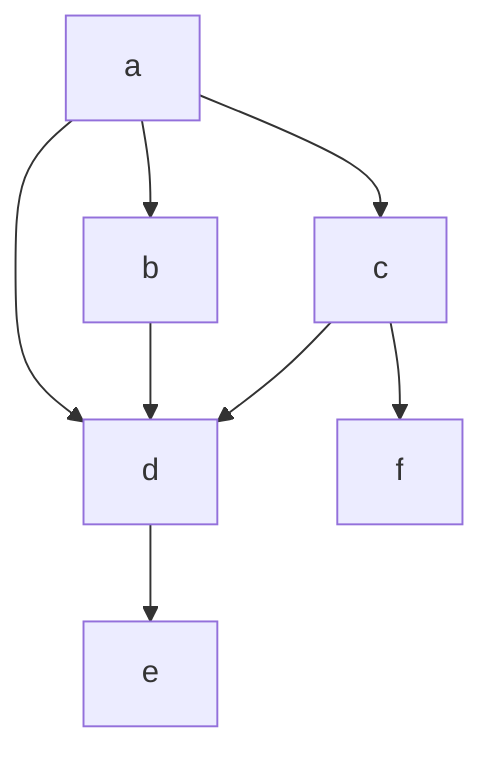
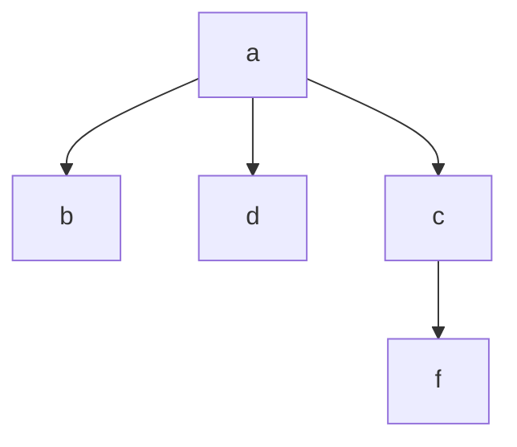

# Busca em grafos

* Entrada: Um Grafo $G_1 = (V, E)$ e um vértice de origem $s$ e $V$.

* Saída: Uma árvore de busca em largura com raiz no vértice $s$.

* * Ou seja, mapear os caminhos mínimos, em números de arestas/arcos de $s$
  para todo $v \in V$ .

$G_1$:

Saída:

$n=|v|$

$m=|E|$

## Algoritmo de Busca em Largura

Entrada: $G=(V, E), s \in V$

| Complexidade | Comando | Linha
| - | - | - |
|$c\cdot n$|$C_v \leftarrow false$ |1|
|$c\cdot n$|$D_v \leftarrow \infin\ \forall\ v \in V$|2|
|$c\cdot n$|$A_v \leftarrow null\ \forall\ v \in V$|3|
|$c$|$C_s \leftarrow true$|4|
|$c$|$D_s \leftarrow 0$|5|
|$c$|$Q \leftarrow Fila()$|6|
|$c$|$Q.enfileira(s)$|7|
|$c\cdot n$|$while\ Q.vazio() = false\ do$|8|
|$c\cdot n$|-- $u \leftarrow Q.desenfileirar()$|9|
|$c\cdot n+c\cdot m$|-- $foreach\ v\in N^+(u)\ do$|10|
|$c\cdot m$|-- -- $if\ C_v=false\ then$|11|
|$c\cdot (n-1)$|-- -- -- $if\ C_v\leftarrow true$|12|
|$c\cdot (n-1)$|-- -- -- $if\ D_v\leftarrow D_u+1$|13|
|$c\cdot (n-1)$|-- -- -- $if\ A_v\leftarrow u$|14|
|$c\cdot (n-1)$| -- -- -- $Q.enfileirar()$|15|
|$c$|$return\ (D, A)$|16|
