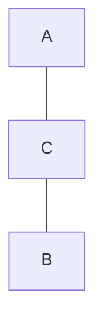

# Representações Computacionais

* Matriz de adjacências.
* Lista de adjacências.

## Matriz de Adjacências

Aloca uma matriz que representa adjacências de um grafo.

-- Vantagens: Acesso direto á memória.

-- Desvantagens: Grafos com muitoas arestas mas poucos vértices.

$G_1$:

| - | a | b | c |
| - | - | - | - |
| a | 0 | 0 | 1 |
| b | 0 | 0 | 1 |
| c | 1 | 1 | 0 |

## Lista de Adjacências

Uma lista ( ou outra estrutura de dado), para representar as adjacências de
cada vértice.

-- Vantagens: Menor uso de memória.

A  $\rightarrow C$

B  $\rightarrow C$

C  $\rightarrow A, B$

## Propriedades

### Graus

### Vizinhos

### Há adjacências
